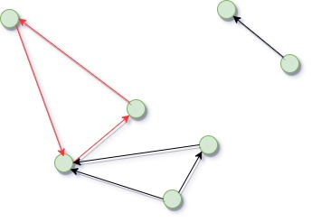

## 寻找有向图中指定长度的简单环

- 目前工作,实现所有的找环算法

## 目录结构
### src
#### app

|-- find_cycle
    |-- src
        |-- algorithm
            |-- Johnson.cpp
            |-- Johnson.h
            |-- Tiernan.cpp
            |-- Tiernan.h
        |-- app
            |-- generate.cpp
            |-- main.cpp
            |-- test.cpp
        |-- io
            |-- reader.cpp
            |-- reader.h
            |-- writer.cpp
            |-- writer.h
        |-- network
            |-- graph.cpp
            |-- graph.h
            |-- mytype.h
        |-- test
            |-- boost_graph_test.cpp
            |-- coost_graph_test.h
        |-- util
            |-- debug.h
            |-- util.cpp
            |-- util.h
    |-- thirs_party 
        |--spdlog
    |-- data
        |-- n3_e5
            |-- n3_e5.txt
        |--n5_e20
            |-- n5_e20.txt
